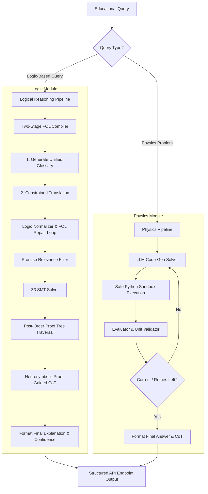

# EXACT: Explainable AI for STEM Education

EXACT is a premium, neurosymbolic QA system designed to tackle logical reasoning and text-based physics problems in educational domains. By combining open-source Large Language Models (LLMs) under 8B parameters with formal symbolic engines—namely the **Z3 SMT Solver** and dynamic Python-based execution solvers—EXACT guarantees mathematical correctness while delivering transparent, verifiable, and human-readable explanations.

> [!IMPORTANT]
> **Challenge Directives Compliance:**
> - **Open-Source Only:** Powered exclusively by open-source LLMs under 8 billion parameters (e.g., `Qwen/Qwen3-8B`).
> - **Strictly Explainable:** Every output answer is formally verified and backed by structured proofs, Chain-of-Thought (CoT) steps, and logical explanations.
> - **Zero Closed-Source Dependency:** Entirely isolated from closed-source APIs (such as GPT, Claude, or Gemini) to satisfy regulatory and safety benchmarks.

---

## 📐 End-to-End System Architecture

The EXACT system isolates logical queries and physics computations into two highly optimized pipelines, unified under a standard orchestration layer:




---


## 🧠 Core Framework Features

### 1. Logical Reasoning System
The EXACT Logic Module translates natural language (NL) to First-Order Logic (FOL) and verifies entailment via the Z3 SMT Solver:
* **Two-Stage Glossary-Constrained Translation:** Combats naming mismatches (e.g., `well_structured` vs `wellStructured`) by first compiling a unified JSON Glossary of predicates/constants before translating statements.
* **FOL Normalization & Repair Loop:** Automatically fixes syntax and casing mismatches. If parsing errors persist, an LLM repair agent retries up to 2 times.
* **Arithmetic & Temporal Logic Support:** Pre-scans and maps temporal markers (e.g. `Time830AM` to `IntVal(510)`) and durations to numerical sorts, upgrading standard sort assertions to `IntSort()` in Z3.
* **Neurosymbolic Proof-Guided CoT:** If Z3 finds a valid proof (`unsat`), it performs post-order traversal on the formal proof tree (`solver.proof()`). The asserted premises and resolution steps are extracted to form a mathematical skeleton, which guides the LLM to generate a hallucination-free explanation.
* **MCQ Process of Elimination:** Eliminates direct contradictions (where Z3 returns `unsat` when adding the target option itself) and performs fallback consistency checks.

### 2. Physics Solving System
The Physics Module compiles numerical problems into executable Python calculations:
* **Code-Generation & Execution:** The LLM receives the question and writes Python code setting the `ans` and `unit` values.
* **Sandboxed Runtime Solver:** The generated code is safely executed in an isolated local namespace, allowing sympy/pint calculation of complex circuits and capacitances.
* **Multi-Step Self-Correction:** Incorporates real-time run-time debugging. If code execution crashes or returns an invalid unit/magnitude, the traceback is fed back to the LLM to re-evaluate and correct the code block.

---

## 📊 Dataset Reference & Specifications

The EXACT framework is validated against two major dataset categories outlined in the project context:

### Dataset Type 1: Logic-Based Educational Queries
Contains **464 records** with **913 questions** designed to evaluate logical reasoning under university academic, grading, and scholarship regulations.
* **Format:** Receives natural language premises (`premises-NL`) and a question.
* **Question Types:** Multiple-Choice (MCQ), Yes/No/Uncertain, and Open-Ended reasoning.

### Dataset Type 2: Physics Problems
Contains **5,520 text-based physics problems** focusing on electric circuits, electrostatics, resistance, voltage, power, and capacitance.
* **Format:** Receives the question only.
* **Output:** Precise numerical answers with standard metric unit tracking.

---

## 🛠️ Installation & Configuration

### Prerequisites
Make sure `uv` is installed on your local path for lightning-fast virtual environment initialization.

### Step 1: Environment Setup
Initialize the project structure and sync virtual dependencies:
```bash
# Initialize venv and sync packages defined in pyproject.toml
uv venv
uv sync
```

### Step 2: Configure Keys
Create a local `.env` file in the root directory (based on the system variables in the `.env` template):
```env
HF_API_KEY=your_hugging_face_token
LOGIC_COMPILER_MODEL=Qwen/Qwen3-8B:featherless-ai
ONTOLOGY_BUILDER_MODEL=Qwen/Qwen3-8B:featherless-ai
GEMINI_API_KEY=your_optional_gemini_key
FOLC_AT=your_folc_access_token
WANDB_API_KEY=your_wandb_token
```

---

## 🚀 Execution & Verification

To verify the system end-to-end, you can execute the integration tests:

1. **Local Integration Smoke Test**: Verifies the FastAPI prediction server locally, checking output formatting schemas and reasoning outputs.
2. **Remote Verification Test**: Validates the fully deployed remote API and model server endpoints live on Modal.

---

## 📬 API Submission Schema & Endpoints

For the EXACT 2026 challenge evaluation, the API Server exposes a unified prediction endpoint:

### 1. Unified Prediction Endpoint (`POST /predict`)

Accepts a single query request and returns a JSON list containing exactly one prediction result.

#### Request Payload (`PredictRequest`):
```json
{
  "query_id": "TEST_T1_0001",
  "type": "type1",
  "query": "Is Student A eligible for graduation?",
  "premises": [
    "A student who has completed at least 120 credits is eligible for graduation.",
    "Student A has completed 125 credits."
  ],
  "options": ["Yes", "No", "Uncertain"]
}
```

#### Response Payload (`List[PredictResponseItem]`):
##### Type 1 (Logical Query) Response:
```json
[
  {
    "query_id": "TEST_T1_0001",
    "answer": "Yes",
    "unit": "",
    "explanation": "Since the first premise establishes that a student with at least 120 credits is eligible for graduation, and the second premise confirms that Student A has completed 125 credits, it follows that Student A meets the requirement for graduation...",
    "premises_used": [0, 1],
    "reasoning": {
      "type": "fol",
      "steps": [
        "Rule: ForAll(x, (Credits(x) >= 120 -> Eligible(x)))",
        "Fact: Credits(a) = 125",
        "Conclusion: Eligible(a)"
      ]
    }
  }
]
```

##### Type 2 (Physics Query) Response:
```json
[
  {
    "query_id": "TEST_T2_0001",
    "answer": "100",
    "unit": "ohm",
    "explanation": "Series resistor network detected. Resistive element summation and total impedance aggregation rules apply. Sum the individual resistances to compute the total series resistance.",
    "premises_used": [],
    "reasoning": {
      "type": "cot",
      "steps": [
        "Two resistors R1 and R2 connected in series",
        "Series connection implies additive resistance",
        "Sum the resistances R1 and R2"
      ]
    }
  }
]
```

---

## 🛠️ Modal Serverless Deployment

EXACT is built to run on serverless cloud architecture using **Modal** for zero idle infrastructure costs.

### 1. Model Server Deployment (GPU L4)
Serves the `Qwen/Qwen3-8B` base model and fine-tuned PEFT adapters on an NVIDIA L4 GPU.
* The vLLM models endpoint (`GET /v1/models`) exposes the base model verification IDs to satisfy the challenge guidelines.

### 2. API Server Deployment (CPU)
Serves the FastAPI prediction endpoint (`POST /predict`) on a warm 1.0 CPU / 2GB RAM container to eliminate cold-start latency.

---

### Evaluation Weighting Matrix
| Criterion | Focus | Objective |
| :--- | :--- | :--- |
| **P1: Correctness** | Answer Accuracy | Generates high-fidelity exact solutions to logical & computational problems. |
| **P2: Quality** | Explanation Clarity | Produces structured, non-verbatim natural language proofs that justify each answer. |
| **P3: Depth** | Reasoning Rigor | Backs answers with formal FOL translations, physical equations, and Z3 SAT/UNSAT proofs. |
