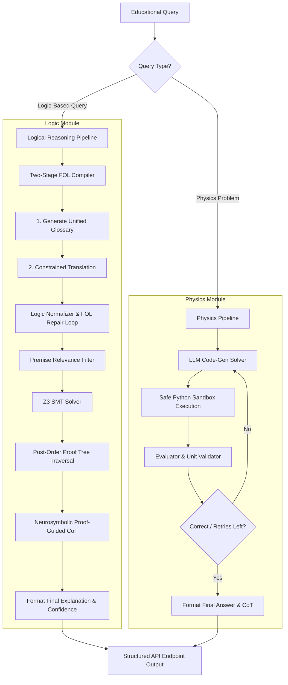

# EXACT: Explainable AI for STEM Education

EXACT is a premium, neurosymbolic QA system designed to tackle logical reasoning and text-based physics problems in educational domains. By combining open-source Large Language Models (LLMs) under 8B parameters with formal symbolic engines—namely the **Z3 SMT Solver** and dynamic Python-based execution solvers—EXACT guarantees mathematical correctness while delivering transparent, verifiable, and human-readable explanations.

> [!IMPORTANT]
> **Challenge Directives Compliance:**
> - **Open-Source Only:** Powered exclusively by open-source LLMs under 8 billion parameters (e.g., `Qwen/Qwen3-8B`).
> - **Strictly Explainable:** Every output answer is formally verified and backed by structured proofs, Chain-of-Thought (CoT) steps, and logical explanations.
> - **Zero Closed-Source Dependency:** Entirely isolated from closed-source APIs (such as GPT, Claude, or Gemini) to satisfy regulatory and safety benchmarks.

---

## 📐 End-to-End System Architecture

The EXACT system isolates logical queries and physics computations into two highly optimized pipelines, unified under a standard orchestration layer:



---

## 📂 Repository Layout & File Directory

Click direct links to inspect specific components:

- [pyproject.toml](pyproject.toml) — Manages Python dependencies (e.g., `z3-solver`, `sympy`, `transformers`, `torch`) via `uv`.
- [.env](.env) — Local environment configuration (model definitions, Hugging Face and Weights & Biases API keys).
- [src/logic/pipeline.py](src/logic/pipeline.py) — End-to-end logical orchestrator `LogicalReasoningPipeline`.
- [src/logic/translation](src/logic/translation) — Compiles natural language statements into logical representations using glossary-constrained translation.
- [src/logic/reasoning](src/logic/reasoning) — Hosts premise filtering, Z3 verification, and proof tree traversal.
- [src/physics/api.py](src/physics/api.py) — Entry point to invoke sync, async, and batch physics solving.
- [src/physics/solver.py](src/physics/solver.py) — Generates Python formulas from physics problems and executes them.
- [src/physics/runner.py](src/physics/runner.py) — Handles the physics execution flow, pipeline retries, and optional self-correction protocols.
- [src/llm/llm_client.py](src/llm/llm_client.py) — Model client to load base models (e.g., `Qwen/Qwen3-8B`) and attach local LoRA adapters.
- [src/llm/prompts.py](file:///d:/mduy/source/repos/EXACT/src/llm/prompts.py) — Centralized configuration file isolating system instructions from operational logic.
- [scripts/run_local_eval.py](file:///d:/mduy/source/repos/EXACT/scripts/run_local_eval.py) — Evaluation launcher script that runs sequential testing to prevent VRAM overflow.

---

## 🧠 Core Framework Features

### 1. Logical Reasoning System
The EXACT Logic Module translates natural language (NL) to First-Order Logic (FOL) and verifies entailment via the Z3 SMT Solver:
* **Two-Stage Glossary-Constrained Translation:** Combats naming mismatches (e.g., `well_structured` vs `wellStructured`) by first compiling a unified JSON Glossary of predicates/constants before translating statements.
* **FOL Normalization & Repair Loop:** Automatically fixes syntax and casing mismatches. If parsing errors persist, an LLM repair agent retries up to 2 times.
* **Arithmetic & Temporal Logic Support:** Pre-scans and maps temporal markers (e.g. `Time830AM` to `IntVal(510)`) and durations to numerical sorts, upgrading standard sort assertions to `IntSort()` in Z3.
* **Neurosymbolic Proof-Guided CoT:** If Z3 finds a valid proof (`unsat`), it performs post-order traversal on the formal proof tree (`solver.proof()`). The asserted premises and resolution steps are extracted to form a mathematical skeleton, which guides the LLM to generate a hallucination-free explanation.
* **MCQ Process of Elimination:** Eliminates direct contradictions (where Z3 returns `unsat` when adding the target option itself) and performs fallback consistency checks.

### 2. Physics Solving System
The Physics Module compiles numerical problems into executable Python calculations:
* **Code-Generation & Execution:** The LLM receives the question and writes Python code setting the `ans` and `unit` values.
* **Sandboxed Runtime Solver:** The generated code is safely executed in an isolated local namespace, allowing sympy/pint calculation of complex circuits and capacitances.
* **Multi-Step Self-Correction:** Incorporates real-time run-time debugging. If code execution crashes or returns an invalid unit/magnitude, the traceback is fed back to the LLM to re-evaluate and correct the code block.

---

## 📊 Dataset Reference & Specifications

The EXACT framework is validated against two major dataset categories outlined in [context.md](file:///d:/mduy/source/repos/EXACT/context.md):

### Dataset Type 1: Logic-Based Educational Queries
Contains **464 records** with **913 questions** designed to evaluate logical reasoning under university academic, grading, and scholarship regulations.
* **Format:** Receives natural language premises (`premises-NL`) and a question.
* **Question Types:** Multiple-Choice (MCQ), Yes/No/Uncertain, and Open-Ended reasoning.

### Dataset Type 2: Physics Problems
Contains **5,520 text-based physics problems** focusing on electric circuits, electrostatics, resistance, voltage, power, and capacitance.
* **Format:** Receives the question only.
* **Output:** Precise numerical answers with standard metric unit tracking.

---

## 🛠️ Installation & Configuration

### Prerequisites
Make sure `uv` is installed on your local path for lightning-fast virtual environment initialization.

### Step 1: Environment Setup
Initialize the project structure and sync virtual dependencies:
```bash
# Initialize venv and sync packages defined in pyproject.toml
uv venv
uv sync
```

### Step 2: Configure Keys
Create a local `.env` file in the root directory (based on the system variables in [.env](file:///d:/mduy/source/repos/EXACT/.env)):
```env
HF_API_KEY=your_hugging_face_token
LOGIC_COMPILER_MODEL=Qwen/Qwen3-8B:featherless-ai
ONTOLOGY_BUILDER_MODEL=Qwen/Qwen3-8B:featherless-ai
GEMINI_API_KEY=your_optional_gemini_key
FOLC_AT=your_folc_access_token
WANDB_API_KEY=your_wandb_token
```

---

## 🚀 Execution & Evaluation

### Running Offline GPU Evaluation
To execute sequential benchmark runs on local datasets (e.g. 200 samples) without triggering VRAM memory overflow, launch:
```bash
uv run scripts/run_local_eval.py
```

### Synchronous Logic Pipeline Execution Example
```python
from src.logic.pipeline import LogicalReasoningPipeline
from src.llm.llm_client import LLMClient

# 1. Initialize LLM client and end-to-end logic pipeline
llm_client = LLMClient()
pipeline = LogicalReasoningPipeline(use_local=True, llm_client=llm_client)

# 2. Define educational rules and target conclusion
premises = [
    "If a curriculum has practical exercises and is well-structured, it enhances student engagement.",
    "The faculty prioritizes curriculum development, so the curriculum is well-structured.",
    "The curriculum has practical exercises."
]
conclusion = "The curriculum enhances student engagement."

# 3. Compile, verify, and explain
result = pipeline.run_pipeline(premises, conclusion)

print("Answer:", result["answer"])          # Output: "Yes"
print("Confidence:", result["confidence"])  # Output: 1.0 (Guaranteed via Z3 solver)
print("CoT explanation:", result["cot"])    # Human-readable step-by-step reasoning
```

---

## 📬 API Submission Schema

For the challenge evaluation, the endpoint accepts queries and returns the following JSON schema:

```json
{
  "answer": "B",
  "explanation": "Premise 3 confirms the curriculum is well-structured. Together with exercises in premise 5, premise 1 is satisfied, leading to enhanced engagement...",
  "fol": "ForAll(c, (well_structured(c) ∧ has_exercises(c)) → enhances_engagement(c))",
  "cot": [
    "Step 1: Identify circuit topology or premises.",
    "Step 2: Apply the compiled Z3 logic solver.",
    "Step 3: Traversed proof tree results in a guaranteed entailment."
  ],
  "premises": [
    "If a curriculum is well-structured and has exercises, it enhances student engagement."
  ],
  "confidence": 1.00
}
```

### Evaluation Weighting Matrix
| Criterion | Focus | Objective |
| :--- | :--- | :--- |
| **P1: Correctness** | Answer Accuracy | Generates high-fidelity exact solutions to logical & computational problems. |
| **P2: Quality** | Explanation Clarity | Produces structured, non-verbatim natural language proofs that justify each answer. |
| **P3: Depth** | Reasoning Rigor | Backs answers with formal FOL translations, physical equations, and Z3 SAT/UNSAT proofs. |
