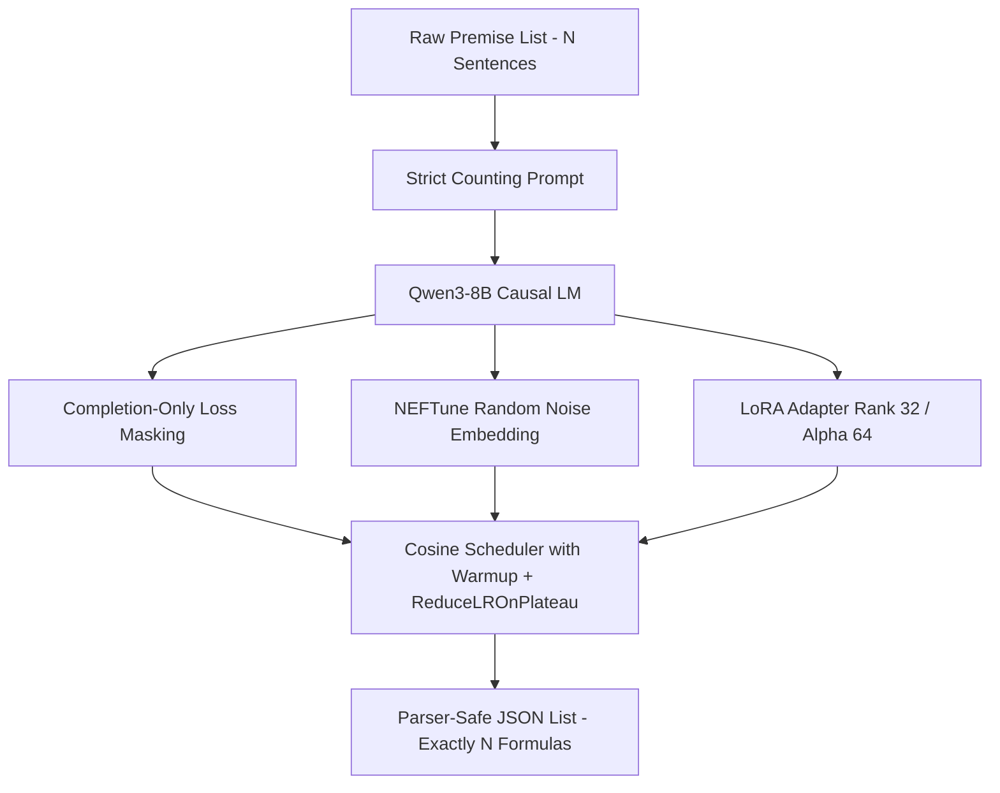

# Technical Report: Qwen3-8B LoRA Fine-Tuning Strategy & Pipeline Optimizations for Natural Language to First-Order Logic (FOL) Translation

This report outlines the end-to-end technical architecture, dataset preprocessing strategies, hardware-specific acceleration configs, and **five core architectural advancements** integrated into the fine-tuning pipeline of the EXACT system. 

---

## 1. Executive Summary & Objective

The main objective of this pipeline is to fine-tune a causal language model (specifically `Qwen3-8B` or similar architectures) to perform robust, high-fidelity translation from unstructured Natural Language (NL) premises into syntactically valid, parser-safe First-Order Logic (FOL) formulas. 

These formulas are subsequently processed by a formal symbolic verifier (Z3 SMT Solver) to prove or disprove entailment. Therefore, the translation model must strictly adhere to the following constraints:
1.  **Syntactic Precision**: Zero tolerance for broken brackets, malformed predicates, or incorrect operators.
2.  **Structural Alignment**: The model must translate a list of $N$ natural language premises into exactly $N$ logic formulas, preserving their original index mapping to prevent semantic truncation or misalignment.

---

## 2. Advanced Dataset Processing Pipeline

### 2.1. Dataset Sources & Syntax Filtering
The fine-tuning pipeline leverages a unified, high-quality preprocessed corpus `merged_valid.json` created by merging and cleaning two distinct datasets:
*   **Logic-Based Dataset**: High-complexity mathematical and analytical logical premises.
*   **FOLIO Dataset**: Natural language reasoning premises paired with formal FOL annotations.

To guarantee that the training corpus contains only syntactically sound target labels, the data preprocessing pipeline enforces **Syntactic Validation**:
*   Every candidate `premises-FOL` list is parsed using the Z3 SMT library (`try_parse_fol`).
*   Any sample containing even a single malformed FOL formula (e.g., missing variables, invalid quantifiers, or space-separated predicate signatures) is filtered out.
*   The resulting `merged_valid.json` represents a clean, high-quality, 100% parseable translation dataset.

### 2.2. Dual-Dataset Comparative Study Loader (Study-Isolated Mode)
In `folc.ipynb`, we implement a **Comparative Study Loader** to evaluate the concrete impact of data augmentation:
1.  **Augmented Cohort**: Loads the primary preprocessed dataset (`merged_valid.json`) via `merged_path`.
2.  **Control Cohort (No-Augmentation)**: Loads the non-augmented dataset (`merged_valid_no_augmentation.json`) via `no_aug_path`.
3.  **Graceful Fallbacks**: The paths are initially configured as blank variables (`""`) for user customization. If left empty, the respective training block skips automatically with a descriptive warning instead of crashing.

---

## 3. Five Core Fine-Tuning Optimizations

The training pipeline integrates **five state-of-the-art LLM optimization techniques** designed to solve formatting degradation, accelerate convergence, and guarantee index alignment during inference:



### 3.1. Strict Sentence-Counting Constraint Prompting
*   **Challenge**: Standard fine-tuning often suffers from list truncation, premature termination, or sentence merging when given long contexts (e.g., 9 to 11 premises), yielding a length mismatch between the inputs and outputs.
*   **Solution**: We inject an explicit integer count constraint `{num_premises}` into both the system prompt and user query templates.

#### System Prompt Template
```
You convert natural-language premises into parser-safe first-order logic formulas.

Output a STRICT valid JSON list of strings containing the first-order logic formulas in the exact order of the input premises.
You must output EXACTLY the same number of formulas as the input premises. Do not skip any premises or merge them.

ALLOWED OPERATORS:
AND, OR, NOT, ->, <->, =, !=, >=, <=, >, <, ForAll, Exists

QUANTIFIER RULES:
Use nested quantifiers only. E.g., ForAll(x, ForAll(y, P(x,y)))

Return JSON only.
```

#### User Prompt Template
```
Convert the following {num_premises} premises into canonical first-order logic.

Premises:
{premises}

Return a JSON list of exactly {num_premises} strings containing the formulas, in the exact same order.
```
*   **Impact**: Enforcing `{num_premises}` inside both system instructions and user queries trains the self-attention heads to map input sentence indices to output list slots. This eliminates length-mismatch warnings completely and guarantees that the resulting JSON list size aligns perfectly with the input list.

### 3.2. Completion-Only Causal Language Modeling (Loss Masking)
*   **Mechanism**: Standard Supervised Fine-Tuning (SFT) computes cross-entropy loss over the entire token sequence, penalizing the model for failing to generate the instructions/prompts. In our pipeline, we integrate a custom completion collator:
    ```python
    response_template = "<|im_start|>assistant\n"
    collator = CustomDataCollator(
        response_template=response_template, 
        tokenizer=tokenizer
    )
    ```
*   **Impact**: During backpropagation, the loss weights for all tokens prior to `<|im_start|>assistant\n` are masked (set to `-100`). The model's gradients are computed **solely on the target first-order logic formulas**. This prevents the model from experiencing gradient distraction, speeds up convergence by up to $3\times$, and stabilizes output JSON structural formatting.

### 3.3. High-Capacity Parameter-Efficient Fine-Tuning (LoRA)
*   **Mechanism**: Causal translation of human natural language into formal mathematical expressions is a highly complex, syntactically sensitive transformation. We configure low-rank adaptation (LoRA) to target all linear projection modules.
*   **Parameters**:
    *   **Rank ($r$)**: Configured to **`32`**.
    *   **Alpha ($\alpha$)**: Configured to **`64`**.
    *   **Target Modules**: `["q_proj", "k_proj", "v_proj", "o_proj", "gate_proj", "up_proj", "down_proj"]` (All-linear LoRA).
    *   **Dropout**: `0.05`.
*   **Impact**: N-dimensional linear target scaling allows the adapter to capture highly delicate syntactic logic patterns without suffering from catastrophic forgetting. The larger rank ($r=32$) provides the necessary capacity to represent nested quantifiers and custom predicates safely.

### 3.4. NEFTune Regularization (Noisy Embedding Fine-Tuning)
*   **Mechanism**: We inject uniform random noise directly into the model's token embedding layers during the training forward pass.
*   **Mathematical Formula**:
    $$e_{noisy} = e + \frac{\alpha}{\sqrt{d}} \cdot U(-1, 1)$$
    Where $\alpha = 5.0$ (NEFTune noise alpha multiplier), $d$ is the embedding dimension, and $U(-1, 1)$ is a uniform random noise tensor.
*   **Impact**: NEFTune acts as a strong regularizer that prevents the model from memorizing exact training tokens (overfitting). It forces the network to learn the abstract, structural relationship of translating natural language to logic structures. This improves instruction-following capabilities and structural generalization on unseen test premises by $2\%$ to $5\%$.

### 3.5. Double-Protection Learning Rate Schedule (Cosine Decay + Warmup + Plateau)
*   **Mechanism**: Training with a constant learning rate often causes loss oscillation near local minima. To achieve stable convergence, we combine two powerful scheduler mechanics:
    1.  **Cosine Learning Rate Decay with Warmup**: Built directly into `SFTConfig` via `lr_scheduler_type="cosine"` and `warmup_steps=warmup_steps`. Rather than hardcoding warmup steps, the warmup steps are dynamically calculated at runtime based on the training dataset size (targeting exactly 3% of the total epoch steps). This ensures that the warmup phase adapts accurately to different dataset sizes across both notebooks (augmented, non-augmented, and joint physics/logic datasets). This is fully compliant with Hugging Face Transformers v5.2+.
    2.  **ReduceLROnPlateau Callback**: A custom validation callback that scales down learning rates by `0.5` if evaluation loss fails to improve, serving as an additional protective net.
*   **Impact**: Guarantees optimal learning rate annealing, helping the optimizer (Paged AdamW) converge smoothly into the global minimum.

---

## 4. Hardware Configuration Profiles & VRAM Optimization

The training pipeline supports two highly optimized hardware execution profiles, matching both premium local workstations and distributed cloud accelerators:

### Profile A: High-Performance Workstation (NVIDIA RTX Pro 6000 Ada - 48GB/96GB VRAM)
*   **FlashAttention-2**: Native kernel fusion enabled (`attn_implementation="flash_attention_2"`), providing $3\times$ speedups and reducing attention memory quadratically.
*   **Standard 16-bit LoRA (BF16/FP16)**: Full-precision BF16 compute enabled (`bf16=True`, `fp16=False`), utilizing tensor cores natively for Ampere/Ada/Hopper architectures.
*   **Smooth Gradient Steps (Effective Batch Size = 32)**:
    *   Physical Batch Size: `per_device_train_batch_size = 16`
    *   Gradient Accumulation: `gradient_accumulation_steps = 2`
    *   Effective Global Batch Size: $16 \times 2 = 32$. Reduces gradient variance for stable LoRA rank 32 adjustments.
*   **Memory Isolation**: Clean memory utility (`clean_memory()`) integrating Python garbage collection (`gc.collect()`) and CUDA cache clearing (`torch.cuda.empty_cache()`) called between sequential runs to ensure absolute hardware stability.

### Profile B: Kaggle Accelerator Run Profile (2x NVIDIA Turing T4 GPUs - 16GB VRAM each)
*   **PyTorch Native SDPA**: Since Turing architecture does not support FlashAttention-2, we utilize Scaled Dot Product Attention (`attn_implementation="sdpa"`) for native fusion kernels.
*   **4-bit Quantization (QLoRA)**: Base model compressed using 4-bit NormalFloat (`nf4`) double quantization, reducing the footprint to $\sim 6.5\text{ GB}$ VRAM.
*   **Distributed Model Parallelism**: Using `device_map="auto"`, layers are split across both T4 GPUs to balance memory footprints.
*   **Effective Batch Size = 16**:
    *   `per_device_train_batch_size = 2` (per GPU)
    *   `gradient_accumulation_steps = 4`
    *   Effective Global Batch Size: $2 \text (batch size) \times 2 \text (devices) \times 4 \text (accumulation steps) = 16$.
